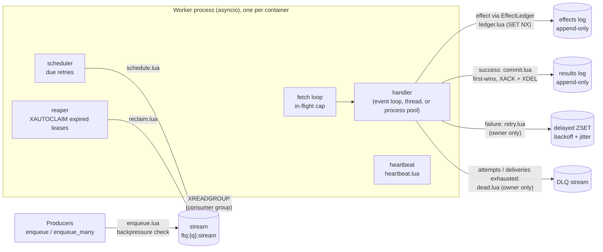
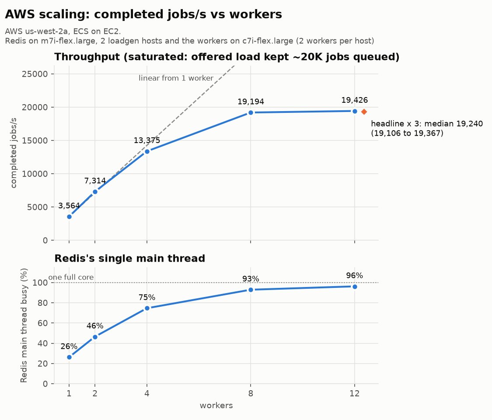
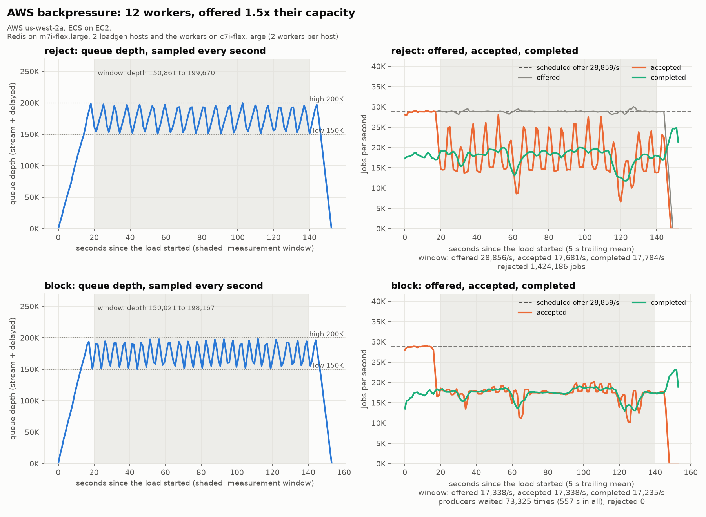

# ftq: Fault-Tolerant Task Queue

[](https://github.com/TechBroMoho/fault-tolerant-task-queue/actions/workflows/ci.yml)

Web apps hand slow work (sending an email, resizing an upload) to a background queue, and
a fleet of workers does it. The hard part is what happens when things break. A worker
crashes mid-job, the network drops, a job keeps failing, or producers submit work faster
than it can be done. **ftq** is a Celery-style task queue built from scratch on Redis
Streams to handle those cases. Every accepted job ends in exactly one final state, and its
side effects happen once, even though delivery is at-least-once. A chaos test proves it: it
kills, freezes, and disconnects workers while a million jobs run, then checks every job. On
AWS, 12 workers completed a median of **19,240 jobs/s**.

- [Architecture](#architecture) · [Guarantees](#guarantees-and-non-guarantees) ·
  [Quickstart](#quickstart) · [Results](#results) · [How the chaos test works](#how-the-chaos-test-works) ·
  [Limitations and future work](#limitations-and-future-work) · [Development](#development)
- Evidence for every number: [docs/RESULTS.md](docs/RESULTS.md). Design decisions and the
  alternatives considered: [docs/DECISIONS.md](docs/DECISIONS.md). Build log, including
  what went wrong: [PROGRESS.md](PROGRESS.md).

## Architecture



- **Transport:** one Redis stream per queue and one consumer group. A delivered entry sits
  in the group's pending list (PEL) until a transition removes it. Its idle time there *is*
  the lease (ADR-001, ADR-023).
- **Every state change is one Lua script**, so it's atomic (ADR-017). Retry, DLQ moves,
  and heartbeats first check with `XPENDING` that the caller still owns the entry and that
  the job has no final state, and otherwise change nothing (`LEASE_LOST`, ADR-024).
  Commit is first-wins and idempotent: a later commit of the same job is counted as a
  suppressed duplicate (ADR-021).
- **Every exit from the stream is `XACK` + `XDEL`**, never `XTRIM MAXLEN`, which can delete
  entries still being worked on (ADR-016). So `XLEN` = waiting + in flight, and
  backpressure can use it.
- **Side effects** go through the `EffectLedger`, a stand-in for a downstream API that
  accepts idempotency keys (like Stripe's): `SET NX` on the key, then append to the effects
  log, in one script (ADR-019).

## Guarantees and non-guarantees

| Property | Guarantee |
|---|---|
| Delivery | **At-least-once.** A job can run more than once: after a crash, a pause longer than the lease, or a network fault. |
| Side effects | **Effectively once** for effects made through the `EffectLedger`, and for results (first-wins commit). An external system is only effectively-once if it honors idempotency keys too. |
| Loss | A job that `enqueue()` accepted ends in exactly one final state: `SUCCEEDED`, or `DEAD` in the dead-letter queue with its last error. |
| Ordering | **None.** Parallel workers, retries with backoff, and reclaimed jobs all reorder work. |
| Durability | Jobs survive worker crashes, pauses, and network faults. **Redis is the trust boundary:** if Redis itself loses data (no persistence, or a crash between AOF fsyncs), the zero-loss claim doesn't hold. The dev and chaos Redis use AOF `everysec` and `noeviction` (ADR-013). The AWS benchmark ran with AOF off (throughput only). Eviction is never allowed: it would silently drop the keys that make effects idempotent. |
| Backpressure | Above `FTQ_HIGH_WATERMARK` (stream + delayed), enqueue raises `QueueFull` (`reject`) or waits (`block`) until depth is below `FTQ_LOW_WATERMARK`. The check is inside `enqueue.lua`, so it's never stale (ADR-031). |

Exactly-once *delivery* isn't possible in general: a worker can finish the work and die
before it can say so. ftq makes the *effects* idempotent instead (ADR-010, ADR-019).

## Quickstart

Requires [uv](https://docs.astral.sh/uv/) and Docker.

```bash
make up WORKERS=4     # Redis + 4 worker containers; then try `uv run ftq bench --jobs 50000`
make chaos N=100000   # the chaos test: ~2 min, prints PASSED/FAILED per invariant
make bench            # local benchmark suites + charts (~25 min) -> results/local/bench/
```

`make down` stops the dev stack. The chaos test and the benchmark start (and remove) their
own Compose projects.

## Results

Every number links to its raw file in [docs/RESULTS.md](docs/RESULTS.md).

| What | Result | Where |
|---|---|---|
| Throughput, 12 workers on AWS | **19,240 jobs/s**, median of 3 × 5-minute runs (19,106 to 19,367), every job exactly once | AWS ECS on EC2, 6 worker hosts |
| Scaling | 3,564 jobs/s (1 worker) → 13,375 (4) → 19,194 (8) → 19,426 (12). It stops at Redis's single main thread (96 % busy) | AWS |
| Backpressure at 1.5 × capacity | reject: 1,424,186 jobs refused; block: producers waited 73,325 times. Queue depth held under the 200K limit, and every accepted job completed exactly once | AWS |
| Chaos, 1M jobs | **10 of 10 runs of 1,000,000 jobs passed** (3 on the final code): 0 lost, 0 duplicate results, 0 duplicate effects, with ~30 kills, ~35 pauses, ~100 network faults, and ~9,000 reclaimed jobs per run | GitHub Actions (on demand) |
| Chaos, every push | 100,000 jobs on every push and pull request | GitHub Actions |





**The bottleneck is Redis's single main thread,** found locally first (ADR-042) and
confirmed on AWS. Past 8 workers, adding workers adds nothing: each job costs Redis three
short Lua scripts plus its share of a batched read, and that thread is 96 % busy. The
latencies in those saturated runs (p50 ≈ 1 s) are queueing, because the benchmark keeps
20K jobs waiting on purpose. Below capacity, local p50 was 2–6 ms.

## How the chaos test works

`make chaos N=…` (`chaos/run.py`, ADR-036) starts Redis, one Toxiproxy with **a proxy per
worker** (so one worker can be cut off while the others keep going), and N worker
containers. The producer and the verifier talk to Redis directly, so "accepted" is never
ambiguous. Then:

1. **The job mix** (seeded, printed, reproducible with `SEED=`): normal jobs; *flaky* jobs
   that fail a deterministic number of times and then succeed; *slow* jobs that don't
   heartbeat, so their lease always expires and another worker takes them; jobs that hang
   past their timeout; *poison* jobs that always fail; *crashy* jobs that kill their
   worker process.
2. **Faults, on a random schedule while jobs flow:** `docker kill` a worker; `docker pause`
   one for longer than the lease (the classic "GC pause zombie" that wakes up and tries
   to finish a job someone else now owns); and on one worker's proxy, connection resets,
   black-holed connections, added latency, or a full partition.
3. **Drain, then verify** against Redis's append-only logs. The build fails if any
   invariant fails:
   - **I1 no loss:** every accepted job has exactly one final state, and only the poison,
     crashy, and hang-forever jobs are `DEAD`;
   - **I2 / I2b no duplicates:** each succeeded job appears exactly once in the effects log
     and once in the results log;
   - **I3:** the DLQ holds exactly the expected jobs, with the right attempt counts;
   - **I4 the faults really happened:** minimum counts of kills, pauses, network faults,
     reclaims, and suppressed duplicates. A run where nothing went wrong proves nothing,
     so it fails;
   - **I5:** stream, pending list, and delayed set are empty. **W1:** no worker crashed
     unexpectedly.

The verifier is tested against planted bugs: a ledger without its `NX` check fails I2, and
a commit without its done check fails I2b (`tests/integration/test_chaos_verifier.py`).

**Recording** of a 100K run with 8 workers: [`results/local/chaos_demo.cast`](results/local/chaos_demo.cast)
(replay: `uvx --from asciinema==2.4.0 asciinema play results/local/chaos_demo.cast`;
plain text: [`chaos_demo.txt`](results/local/chaos_demo.txt); re-record: `make
chaos-record`). How it ends (timestamps and three detail lines removed):

```
==== chaos run PASSED (seed 2034644800, 100000 jobs, 8 workers) ====
  I1_no_loss                 ok
  I2_no_duplicate_effects    ok
  I2b_no_duplicate_results   ok
  I3_dlq_correct             ok
  I4_faults_happened         ok
  W1_workers_healthy         ok
  I5_drained                 ok
  faults {'kills': 8, 'pauses': 6, 'network_windows': 21}
  processed 99974 dead 26 reclaimed 1079 duplicates_suppressed 283 effects_suppressed 280 timeouts 369 lease_lost 136
  seconds {'fault_phase': 72.6, 'drain': 20.1, 'total': 98.9} | redis memory peak 56 MiB of maxmemory 3072 MiB
```

## Limitations and future work

- **One Redis is the ceiling** (~19K jobs/s here). The next step is sharding: queues are
  already hash-tagged (`ftq:{queue}:…`), so each queue's keys live in one Redis Cluster
  slot and one queue's scripts stay atomic. Spreading one hot queue over several shards
  (N streams, producers hashing to one, workers reading all) is the design sketched in
  ADR-050. Redis 8's `io-threads` might add some headroom, but it wasn't measured on AWS.
- **Redis durability is out of scope** for the zero-loss claim: the chaos test never kills
  Redis, and the AWS runs had no AOF. A durability test with `appendfsync always` and Redis
  restarts during chaos is a stretch goal (SPEC §12).
- **Effects are only as idempotent as the downstream system.** The ledger stands in for an
  API that honors idempotency keys; one that doesn't can see a duplicate call.
- **No ordering, priorities, or cron.** Out of scope (SPEC §2).
- **The results and effects logs are never trimmed** (ADR-021): fine for tests and
  benchmarks that start from empty, not for a long-lived production queue.
- **The 1M-job chaos run isn't per push:** it takes ~35 min, so every push runs 100K. The
  nightly 1M schedule is configured but hasn't fired yet. All 1M results so far were
  started by hand.
- **Not measured:** worker CPU on AWS, latency on AWS below saturation (see
  [RESULTS.md](docs/RESULTS.md#what-was-not-measured)).

## Development

```bash
make setup      # install Python 3.12 deps from uv.lock
make check      # format check + lint + mypy --strict + fast tests (~16 s; needs `make up`)
make check-all  # the same with every test, including the `slow` ones (~2 min; what CI runs)
make help       # every target, including the AWS ones (docs/RESULTS.md has the session commands)
```

Try it by hand:

```bash
uv run ftq worker                      # Ctrl-C / SIGTERM drains in-flight jobs, then exits
uv run ftq enqueue send_email --payload '{"to": "ada@example.com"}' --idempotency-key signup-ada
uv run ftq enqueue flaky --payload '{"fail_times": 2}'     # fails twice, retried with backoff
uv run ftq enqueue poison                                   # ends in the dead-letter queue
uv run ftq dlq list                                         # DLQ entries as JSON lines
uv run ftq dlq requeue <job_id>                             # or --all
uv run ftq stats                                            # depth, in flight, delayed, DLQ, counters
uv run ftq bench --jobs 50000                               # enqueue N, wait, check exactly-once
```

Built-in handlers: `send_email` (I/O, effect via the ledger), `cpu_task` (CPU-bound, runs in a
process pool), and the deliberate failures `flaky`, `poison`, `crashy` (kills its worker),
`slow` (no heartbeats), and `hang` / `hang_thread` / `hang_process` (hang past a short 2 s
timeout on their first attempts). Handlers are `async def` functions on the event loop, or plain functions
registered with `register_sync(..., pool="thread" | "process")` for blocking or CPU-bound work
(ADR-028). Every run has a timeout (`FTQ_JOB_TIMEOUT`, or `timeout=` per handler type); a run
that exceeds it is a failed attempt (ADR-030).

The Python API is `await Client(redis, settings).enqueue("send_email", {...}, idempotency_key=...)`
or `enqueue_many([...])` (one pipelined round trip). It is an in-process library call; there is
no HTTP API (ADR-015). When the queue is at `FTQ_HIGH_WATERMARK`, enqueue raises `QueueFull`
(`reject` mode) or waits for room (`block` mode) until the depth is below `FTQ_LOW_WATERMARK`
(ADR-031).

### Configuration

Every knob is an `FTQ_*` environment variable (`src/ftq/config.py`):

| Env var | Default | Meaning |
|---|---|---|
| `FTQ_REDIS_URL` | `redis://localhost:6379/0` | Redis connection URL. |
| `FTQ_SOCKET_TIMEOUT` | `5.0` | Seconds to wait for any single Redis reply before raising TimeoutError. |
| `FTQ_SOCKET_CONNECT_TIMEOUT` | `2.0` | Seconds to wait for a TCP connect to Redis. |
| `FTQ_HEALTH_CHECK_INTERVAL` | `10.0` | Ping idle pooled connections older than this (s) before reuse; 0 disables. |
| `FTQ_RETRY_ATTEMPTS` | `3` | Client-side retries of a command after a connection error or timeout. |
| `FTQ_RETRY_BACKOFF_BASE` | `0.05` | Base (s) of the jittered exponential retry backoff. |
| `FTQ_RETRY_BACKOFF_CAP` | `1.0` | Cap (s) on a single retry backoff sleep. |
| `FTQ_QUEUE` | `default` | Queue name (one stream + group each). |
| `FTQ_GROUP` | `workers` | Consumer group name within the queue. |
| `FTQ_CONCURRENCY` | `10` | Max jobs in flight per worker process (also the XREADGROUP COUNT cap). |
| `FTQ_BLOCK_MS` | `1000` | XREADGROUP BLOCK timeout (ms). Bounds how long a stop request waits. |
| `FTQ_SHUTDOWN_GRACE` | `30.0` | On SIGTERM, seconds to let in-flight jobs finish before abandoning them. |
| `FTQ_PROCESS_POOL_SIZE` | `2` | Processes for CPU-bound handlers registered with pool='process' (ADR-028). Thread-pool handlers get `concurrency` threads. |
| `FTQ_JOB_TIMEOUT` | `300.0` | Seconds one handler run may take before it counts as a failed attempt (ADR-030). A handler type can override it at registration. |
| `FTQ_VISIBILITY_TIMEOUT` | `30.0` | Lease length (s): an entry idle this long in the PEL is reclaimed by XAUTOCLAIM. |
| `FTQ_HEARTBEAT_INTERVAL` | `10.0` | Seconds between lease extensions of a running job; at most lease / 3. |
| `FTQ_REAP_INTERVAL` | `5.0` | Seconds between reaper passes (XAUTOCLAIM of expired leases). |
| `FTQ_MAX_ATTEMPTS` | `5` | Handler runs (first try + retries) before a failing job goes to the DLQ. |
| `FTQ_MAX_DELIVERIES` | `10` | Deliveries of one stream entry (XPENDING count) before it goes to the DLQ unrun: the job keeps crashing its worker. |
| `FTQ_SUSPECT_DELIVERIES` | `3` | A reclaimed entry at this delivery count or more is suspected of crashing its workers; each worker runs at most one suspect at a time, so jobs that ran beside a crashing job don't follow it to the DLQ (ADR-035). |
| `FTQ_JOB_BACKOFF_BASE` | `1.0` | Retry delay base (s): delay = random(0, min(cap, base * 2^attempt)). |
| `FTQ_JOB_BACKOFF_CAP` | `300.0` | Cap (s) on a single retry delay. |
| `FTQ_SCHEDULER_INTERVAL` | `0.5` | Seconds between moves of due retries from the delayed set to the stream. |
| `FTQ_SCHEDULER_BATCH` | `500` | Max due retries moved per scheduler pass. |
| `FTQ_CONSUMER_PRUNE_IDLE` | `3600.0` | Delete a group consumer idle this long (s), but ONLY if it owns zero pending entries (deleting one that does would drop its jobs from the PEL). |
| `FTQ_CONSUMER_PRUNE_INTERVAL` | `60.0` | Seconds between consumer-cleanup passes. |
| `FTQ_BACKPRESSURE_MODE` | `reject` | When the queue is full: 'reject' raises QueueFull at once; 'block' waits (up to block_timeout) for the depth to fall below the low watermark. |
| `FTQ_HIGH_WATERMARK` | `100000` | Queue depth (stream length + delayed retries) at which enqueue stops accepting jobs. |
| `FTQ_LOW_WATERMARK` | `80000` | Once full, enqueue accepts jobs again only when depth falls below this. |
| `FTQ_BLOCK_TIMEOUT` | `30.0` | In 'block' mode, seconds to wait for room before raising QueueFull. |
| `FTQ_BLOCK_POLL_INTERVAL` | `0.05` | In 'block' mode, seconds between admission retries while full. |
| `FTQ_LOG_LEVEL` | `INFO` | INFO logs lifecycle events only; per-job lines are DEBUG. |
| `FTQ_LOG_FORMAT` | `json` | 'json': one object per line with job_id/attempt/worker_id fields. |
| `FTQ_DONE_TTL_SECONDS` | `604800` | TTL of done/ledger keys; 0 = never expire (chaos and tests). Must outlast any possible redelivery of the job (ADR-010). |
| `FTQ_IDEMPOTENCY_TTL_SECONDS` | `86400` | How long an enqueue idempotency key maps to its original job_id. |

## License

MIT. See [LICENSE](LICENSE).
